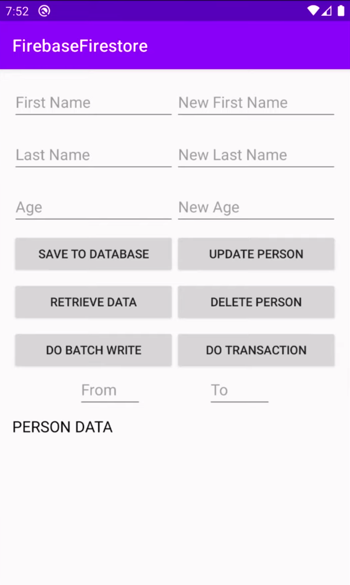

#  Firebase Firestore Demo

<aside>

<table style="width:100%">
  <tr>
    <td>

## Firebase Firestore Demo
- set()
- get()
- update()
- remove()
- batch write
- runTransaction()

</td> 
<td>
  
</td>
</tr>
</table>
